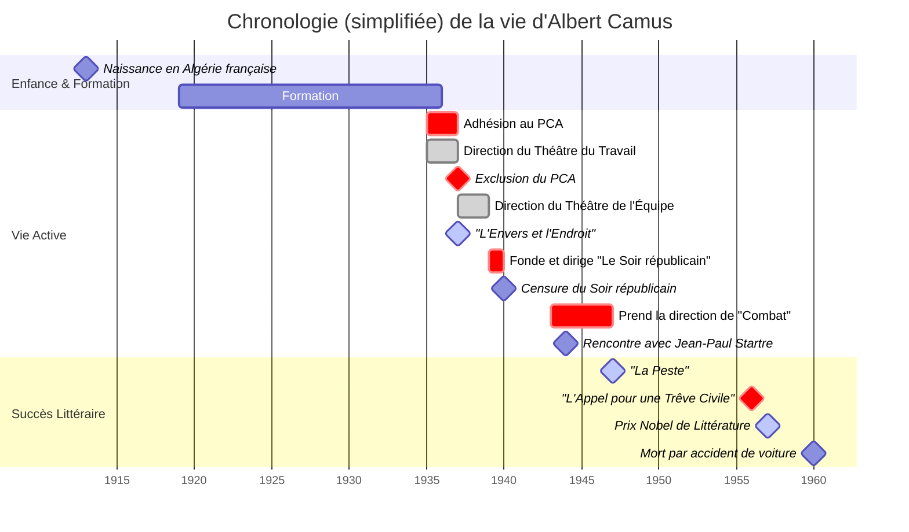

# EAF Français - Oral : Entretien

## Albert Camus, "L'Étranger", 1942

&nbsp;

### [Albert Camus](https://fr.wikipedia.org/wiki/Albert_Camus)
|Naissance|Décès|
|:-|-:|
|**1913** (0 ans lol)|**1960** (46 ans)|
|Algérie française ([Mondovi](https://fr.wikipedia.org/wiki/Dr%C3%A9an))|France métropolitaine ([Villeblevin](https://fr.wikipedia.org/wiki/Villeblevin))|

&nbsp;

&nbsp;

#### Naissance

Albert Camus naît le 7 Novembre 1913 d'une famille pauvre en Algérie française.

&nbsp;

#### Formation

Il étudie à Alger et obtient diplôme d’études supérieures en Lettres, section philosophie en 1936.

&nbsp;

#### Carrière littéraire et engagement politique

&nbsp;

Logotype officiel du PCA.

&nbsp;

En 1935, il adhère au [**P**arti **C**ommuniste **A**lgérien](https://fr.wikipedia.org/wiki/Parti_communiste_alg%C3%A9rien), dont il sera expulsé en 1937 de par ses protestations à l'encontre de sa stratégie politique.

&nbsp;

#### "[L'Envers et l'Endroit](https://fr.wikipedia.org/wiki/L'Envers_et_l'Endroit)", 1935

En 1937 sort la première œuvre signée du nom de Camus: *L'Envers et l'Endroit*. Elle est une suite d'essais relatant le quartier algérois de Belcourt et deux voyages en Europe

&nbsp;

#### Direction de "[Combat](https://fr.wikipedia.org/wiki/Combat_(journal))"

Albert Camus prend la direction de Combat, un journal résistant, en 1943.

&nbsp;

#### "[La Peste](https://fr.wikipedia.org/wiki/La_Peste)", 1947

Publié en 1947, *La Peste* est un roman prenant scène à [Oran](https://fr.wikipedia.org/wiki/Oran) en Algérie française durant une épidémie de peste, la séparant du monde extérieur.

&nbsp;

#### Prix Nobel de littérature, 1957

Albert Camus [reçoit le prix Nobel de littérature](https://www.nobelprize.org/prizes/literature/1957/camus/25232-albert-camus-banquet-speech-1957) le 16 octobre 1957.

&nbsp;

---

&nbsp;

### "[L'Étranger](https://fr.wikipedia.org/wiki/L%27%C3%89tranger)", 1942

&nbsp;

---

&nbsp;

### Sources

<!-- - MY SOURCE IS THAT I MADE IT THE FUCK UP -->

- [Albert Camus - Wikipedia [FR]](https://fr.wikipedia.org/wiki/Albert_Camus)
- [L’Algérie : l'enfance de Camus - Lumni](https://www.lumni.fr/article/l-algerie-l-enfance-de-camus)

&nbsp;

- [L'Envers et l'Endroit - Wikipedia [FR]](https://fr.wikipedia.org/wiki/L'Envers_et_l'Endroit)
- [L'Étranger - Wikipedia [FR]](https://fr.wikipedia.org/wiki/L%27%C3%89tranger)
- [La Peste - Wikipedia [FR]](https://fr.wikipedia.org/wiki/La_Peste)
    - > Le développement de certaines sections de cet article peuvent contenir un travail inédit ou des déclarations non vérifiées (avril 2022). 
    - > Cet article n’est pas rédigé dans un style encyclopédique (avril 2022).

&nbsp;

- [Parti communiste algérien - Wikipedia [FR]](https://fr.wikipedia.org/wiki/Parti_communiste_alg%C3%A9rien)
    - > Cet article ne cite pas suffisamment ses sources (mai 2021).

&nbsp;

- [Combat - Wikipedia [FR]](https://fr.wikipedia.org/wiki/Combat_(journal))
- [Le Soir républicain - Wikipedia [FR]](https://fr.wikipedia.org/wiki/Le_Soir_républicain)